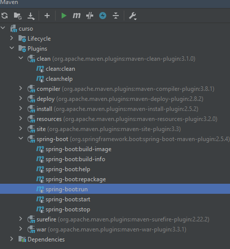
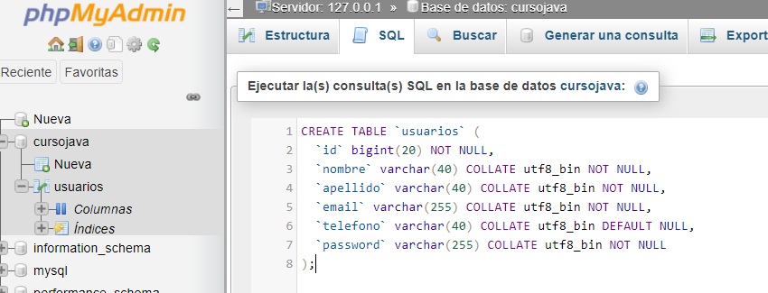

# USER WEB PAGE 

| author | Description | version |
| ----------- | ----------- | ------- |
| Gianfranco | Spring Boot Web + Jquery + Ajax | 1.0.0 |

---

### Install application XAMPP

Install version XAMPP 7.3.30 / PHP 7.3.30 

### Compile application with spring boot



### Server Mysql

http://localhost/phpmyadmin/index.php

````roomsql
CREATE TABLE `usuarios` (
  `id` bigint(20) NOT NULL,
  `nombre` varchar(40) COLLATE utf8_bin NOT NULL,
  `apellido` varchar(40) COLLATE utf8_bin NOT NULL,
  `email` varchar(255) COLLATE utf8_bin NOT NULL,
  `telefono` varchar(40) COLLATE utf8_bin DEFAULT NULL,
  `password` varchar(255) COLLATE utf8_bin NOT NULL
);

````



### Create table


### REFERENCES

[XAMPP](https://www.apachefriends.org/download.html)